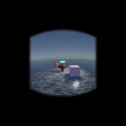
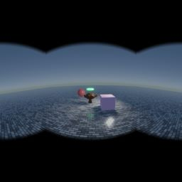
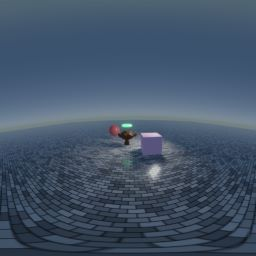

# eeVR

Blender addon to render 360° and 180° images and videos in eevee engine with support for stereoscopic rendering.

## Getting Started

You will need to get [**Blender 3.x**](https://www.blender.org), install it, download the zip file from this GitHub, load the addon into Blender by installing the zip file in Blender Preferences > Add-ons > Install, search for "eeVR" under the Community tab and click the checkbox to enable it. A tool panel will appear in the 3D Viewport's **Tool tab**, FOV value adjustment, and buttons for rendering stills and animations. **The rendered images/image sequences will be stored in the same directory as the .blend file**.

**NOTE** : The eeVR panel appears only when the render engine is EEVEE or WORKBENCH.

 

### Stitch Margin

An angle for seam blending.

Stitch Margin = 5°

 +  = 

Final Image

### Front View Overscan

The resolution is calculated so that the angle of view of each camera (front, back, top, bottom, and side) fits the final rendering resolution, but in this case the panorama is stretched and the front center is not resolved enough.

The resolution can be increased by this amount only for the frontal rendering to compensate for the lack of resolution.

The default setting of 25% almost eliminates the lack of resolution in the center of the image, but it results in excessive resolution on the periphery.
This means that rendering will take more time.

### No Side Plane

Generates panorama image **without rendering side views**.

It is neccesary Horizontal FOV is under 160°.

If you set same angle for Horizontal FOV and Vertical FOV both, eeVR makes panorama image from front render image only.

## License

This project is licensed under the GNU General Public License v3.0 - see the [LICENSE.md](LICENSE.md) file for details.

## Acknowledgments

- The image conversion OpenGL shader was originally created by [Xyene](https://github.com/Xyene) and modified for use in Blender so thank you.

### Original Founder

[EternalTrail](https://github.com/EternalTrail)
